# BackproPygation
## About
This is an implementation of the Backpropagation Artificial Neural (*ANN*) Network using Python.  
Based on the [video](https://www.youtube.com/watch?v=tIeHLnjs5U8&list=PLZHQObOWTQDNU6R1_67000Dx_ZCJB-3pi&index=4) by 3Blue1Brown.
## Usage
This project makes use of the MNIST number dataset to train the neural network. The training and testing images and labels con be downloaded [here](https://drive.google.com/file/d/11ZiNnV3YtpZ7d9afHZg0rtDRrmhha-1E/view) and are needed to be in a *dataset* directory.  
Alternatively, a module like Keras can be used to import this data, but this would require the rewriting of the `mnist_utils.py` script file. 
To run the main script, it's necessary to first compile the `libs` directory.
## Theory
Suppose an ANN with a certain number of input and output neurons and an arbitrary number of hidden layers, each with a random number of neurons like the following:
  
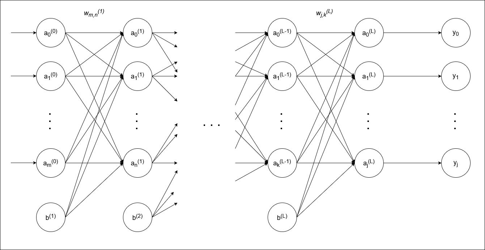
Each input neuron represents a characteristic of an object and each output neuron represents the level of association that the network *"thinks"* the object has with each possible result. In this case, the input layer (Layer 0) represents each pixel value for a hand drawn image of a number and the output layer (Layer *L*) dictates which number (0 through 9) that image is most resemble of.
The hidden layer(s) is where most of the reasoning happens, but is also where the network is on its own, as the architect only has influence over the number of hidden layers and the minimum and maximum number of neurons in each one. For this implementation, the number of hidden layer can be manually defined, but the number of neurons in each layer is randomly selected. 
Every neuron in each layer is connected to every neuron in the next layer via a *weight* that defines how much of an impact this particular neuron has in the activation of the next one. An additional neuron called a *bias* is inserted in each layer (except the output one) to help shift the activation function. Both the weights and biases are initiated with random values that are tweaked during the learning phase to achieve the desired results.
#### Learning
Once the structure of the ANN is defined, the learning process can begin. 
In this phase, a series of learning examples are presented to the network and it computes a result telling how much each example resembles each possible output. The program then takes notes of how wrong (or right) the network was in its calculations and continues with the next example. After a certain number of training examples, the program adjusts the weights and biases based on the notes taken to try and make the network learn from its mistakes. 
Learning can be conducted in two major ways:
* **Stochastic**: where weights and biases are adjusted with each example. This results in a (computationally) slower learning, but with more accurate results.
* **Mini-batch**: where an average of the taken notes is made over a number of training examples before adjusting the weights and biases.
Once all training examples are consumed and the network (hopefully) was able to learn, the testing phase begins.
#### Testing
From all possible examples, a few are selected and set aside (not used during training) to test the accuracy of the network. 
During this phase, each test case is fed into the network and the results are taken as they are, no note taking or weight adjusting take place at this time. If the results are acceptable, the network is considered as trained; if not, it must be trained again, adjusting its learning rate and/or providing a larger training set.
### The math
For this section, three distinct phases can be identified: forward and back propagation and weight tweaking. 
#### Forward propagation
This phase doesn't deviate much from most other neural network, as the input characteristic are multiplied with the weights from layer 1 (plus the bias) and the result is then passed into the activation function (sigmoid, tan, reLU or some other). This will dictate the activation of each neuron of the next layer and that will be multiplied with the weights of the second layer and so on.
* Weights (*w*) and bias (*b*) addition for layer *l*:
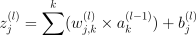
* Next layer (*l+1*) neuron activation:
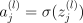

The activation of the output layer's neurons are then compared with the expected output for each training example. This will tell the program how far off the network was from its target result (the note taking part).

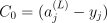
#### Back propagation
This is where things get tricky, as the program needs to compute how much **each individual weight** influences the Cost (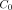) function. And for that, the following formula applies:

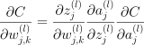
Which can be simplified to 

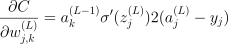 

for the output layer, and

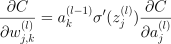 
where

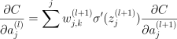 
for every other layer.
#### Weight tweaking
Once every individual influence has been calculated, the results can be used to adjust the weights with each example or mini-batch, depending on the learning type.
To adjust the weights, the following formula is used:
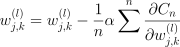 
where 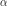 is the learning rate (a number between 0 and 1) and *n* is the number of training examples for each mini-batch. 